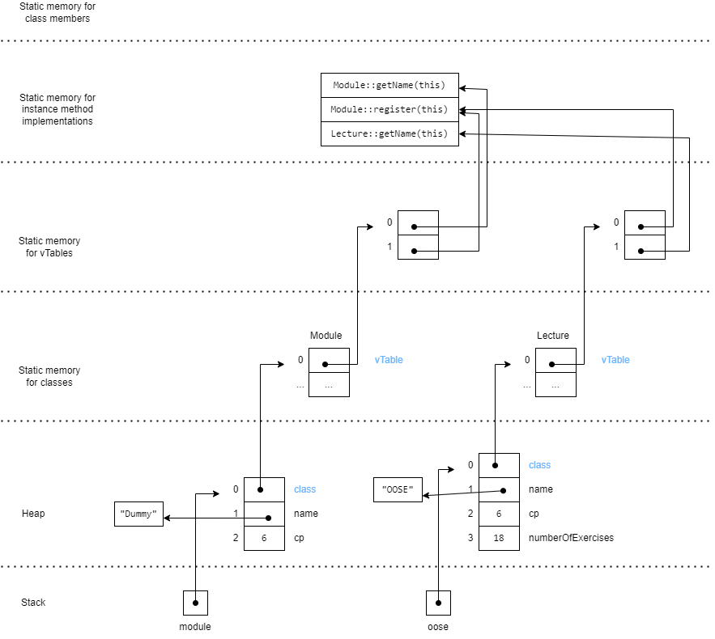
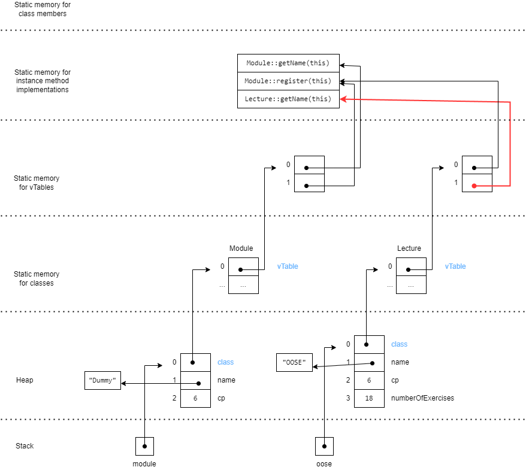

# Exercise 3

## Instance stored in memory

The diagram represents two classes, _Module_ and _Lecture_. Hereby, the class _Lecture_ extends the class _Module_, i.e., it takes over its existing attributes and methods and overrides even the method _getName()_. Further, the codeblock shows two instances from the class Module and Lecture.

Therefore, in the memory, we have two instances named _module_ and _oose_ in the stack. Each of these instances in stack has a reference to its object class in the heap.

In the heap, the attributes of the instantiated class are being stored or referenced to other objects in the heap. To be precise, the instantiated _module_ has two attributes _name_ and _cp_ where _name_ is referenced to another object and _cp_ (integer-datatype) is stored directly in the object. This also applies to the _lecture_ instance but with the difference it has an additional attribute _numberofExercises_ stored directly in the object.

Both objects reference individually to their class in the static memory for _Module_ and _Lecture_ classes. These objects reference the class structure in the vTables again.

In the vTable, for each class, its method is listed and referenced to their implementation in the dedicated memory space for instance method implementation.
On the one hand, the class structure of Module lists two methods _getName_ and _register_ which reference to the actual implementation denoted by r1 for _getName_ and r2 for _register_.
On the other hand, the class structure of Lecture also lists two methods, _getName_ and _register_ which also reference to the actual implementation. However, the method _getName_ is a new method and overrides the implementation by altering the reference of implementation r1 by r3. Thus, the reference is now r2 for register and r3 for getName.

In the instance method implementations, we have the implementation of Module::getName(this) (r1), Module::register(this) (r2) and Lecture::getName(this) (r3).

## How does overriding works

As mentioned, the overriding works by altering the reference from the method implementation Module::getName(this) to Lecture::getName(this) in the vTable. This is true, as the method signature of Lecture::getName is the same as Module::getName, therefore eligible for overriding.
Thus, overriding works by altering the link to the new implementation and not, as the name suggest, by replacing the old method implementation.

## Layout

### Standard Memory Layout

### Memory Layout with override link highlighted

