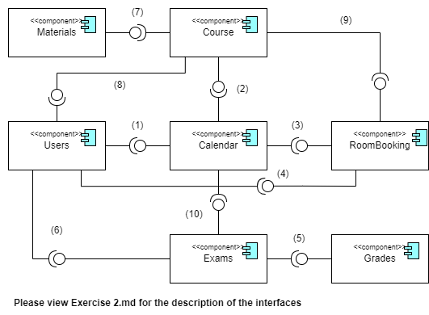

# Exercise 2

## Description of the interface

1) The User component access the Calendar component to view calendar entries.
2) The Calendar component access the Course component to obtain the course dates to fill it in the calendar.
3) The Calendar component access the Room booking component to obtain a list of booked rooms with their respective time slot to fill it in the calendar.
4) The User component access the Room booking component to book a room in a certain time slot.
5) The Exam component access the Grade component to enter the grade of a student's exam and obtain the grade of a particular past exam.
6) The User component access the Exam component to get a list of future exams, registering/de-registering for them, past exams and their grade.
7) The Course component access the Materials component to retrieve its course's materials.
8) The User component access the Course component to get a list of their current courses, including the material of the course.
9) The Course component access the Room booking component to book rooms for the course.
10) The Calendar component access the Exam component to get the exam's date.

## Component Diagram

