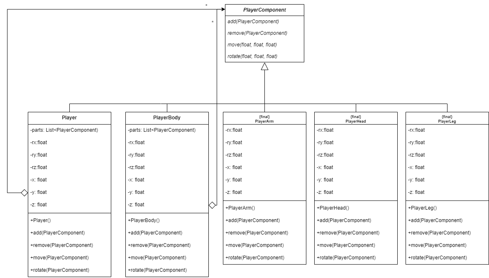

# Exercise 1

## What design pattern?

In the present code, the __Composite__ pattern has been used because we have an interface named _PlayerComponent_ that requires its inherited subclasses to have the methods _add_, _remove_, _move_, _rotate_.

## Class diagram of Players

Below is the class diagram of players, illustrating the composite pattern applied.

